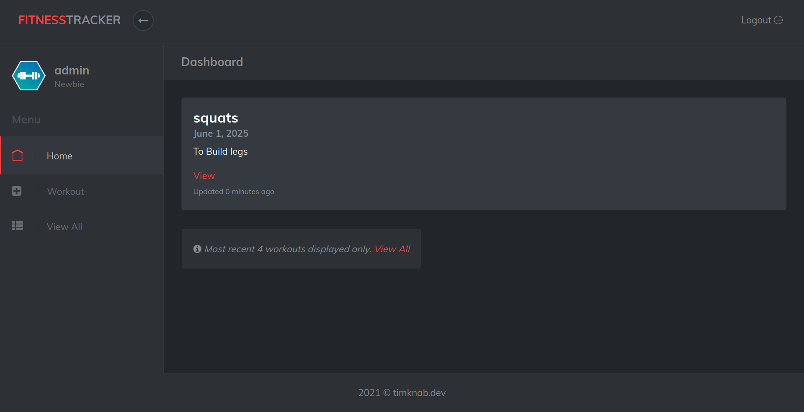
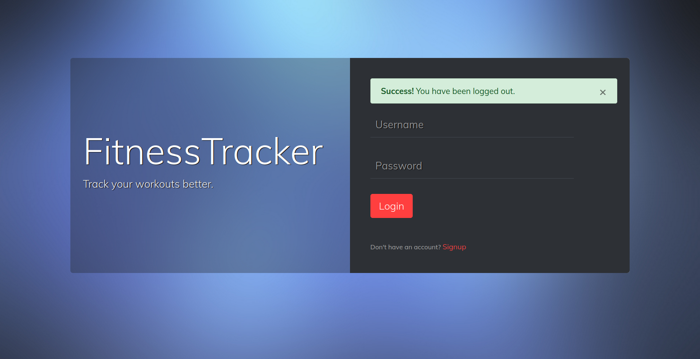
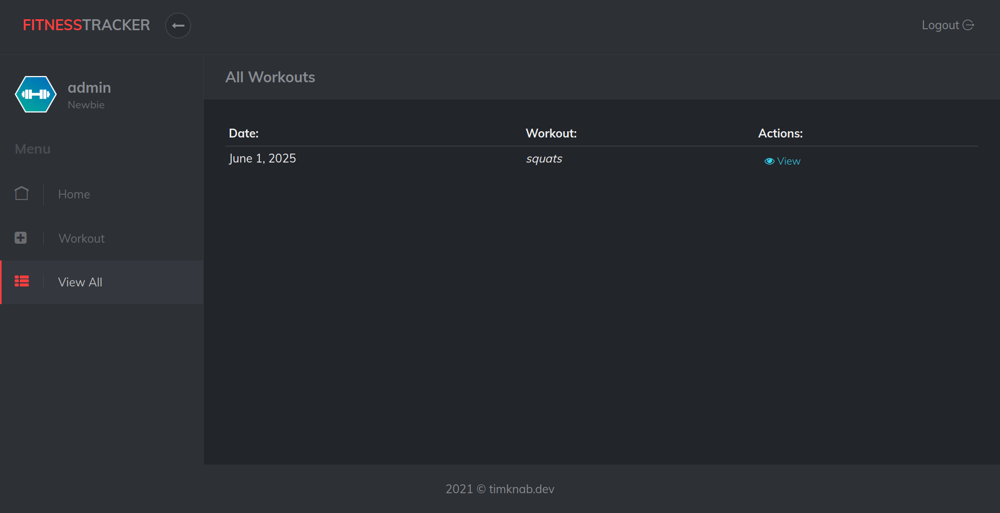
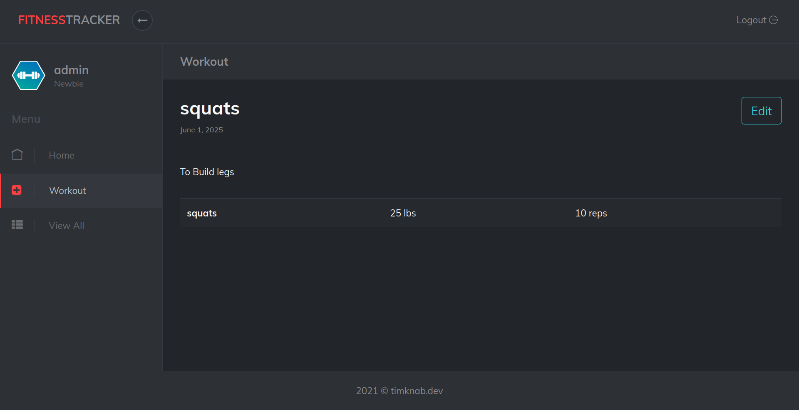

# Workout Tracker

**Workout Tracker** is a dynamic exercise tracking web application built using the Django framework. It allows users to log, monitor, and receive feedback on their workout routines through an intuitive and user-friendly interface. The application is containerized using Docker for seamless environment setup and is integrated with Jenkins for automated deployment. Designed to compete with existing fitness trackers, it stands out with its simplicity and ease of use.

## Screenshots

Here are some example screenshots showcasing the main features and user interface of Workout Tracker:

  
*The main landing page after user login.*  

  
*User logout confirmation screen.*  

  
*A list view of all logged workouts.*  

  
*Detailed view of a single workout entry.*

